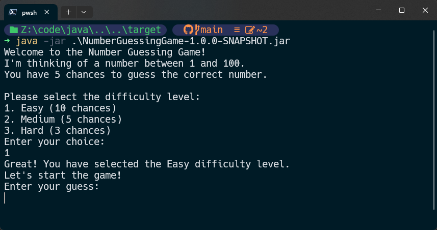

<div align="center">
  <h1 align="center"><a href="https://github.com/ASJordi/number-guessing-game">Number Guessing Game</a></h1>

  <p align="center">Simple number guessing game in Java</p>
</div>

## About :computer:

Simple number guessing game where the computer selects a random number and the user has to guess it. The user will have a limited number of chances to guess the number. If the user guesses the number correctly, the game will end and the user will win. Otherwise, the game will continue until the user runs out of chances.

 <br>


## Technologies :gear:

- Java 21

## Installation :floppy_disk:

1. Clone the repository
2. Open the project in your favorite IDE
3. Run the project
4. Or build the project with Maven and run the generated jar file

```bash
mvn clean install
```

## License :page_facing_up:

Distributed under the MIT License. See `LICENSE` for more information.

## Contact :email:

Jordi Ayala - [@ASJordi](https://twitter.com/ASJordi)

Project Link: [https://github.com/ASJordi/number-guessing-game](https://github.com/ASJordi/number-guessing-game)

Reference: [https://roadmap.sh/projects/number-guessing-game](https://roadmap.sh/projects/number-guessing-game)